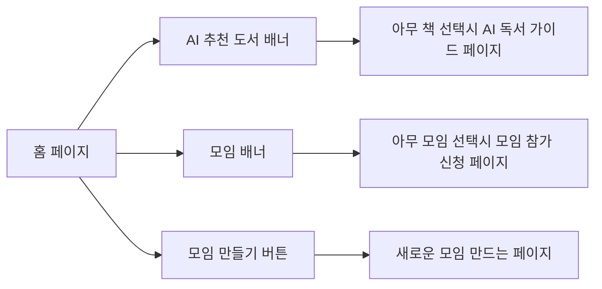
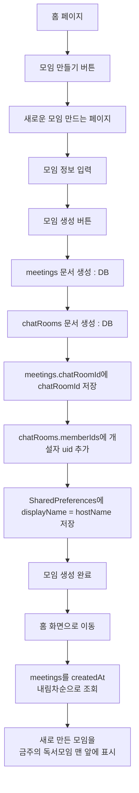
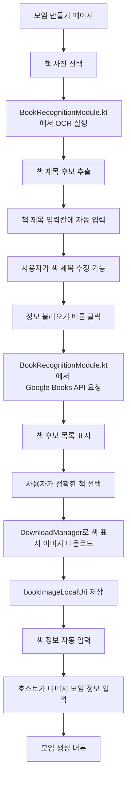
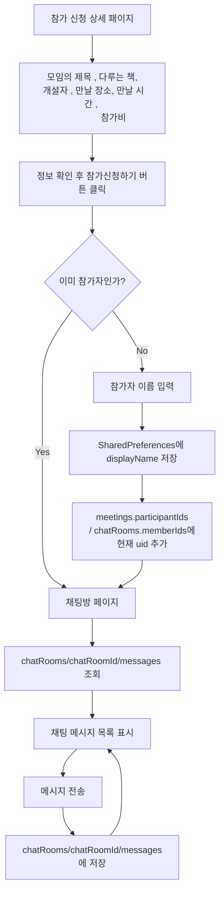
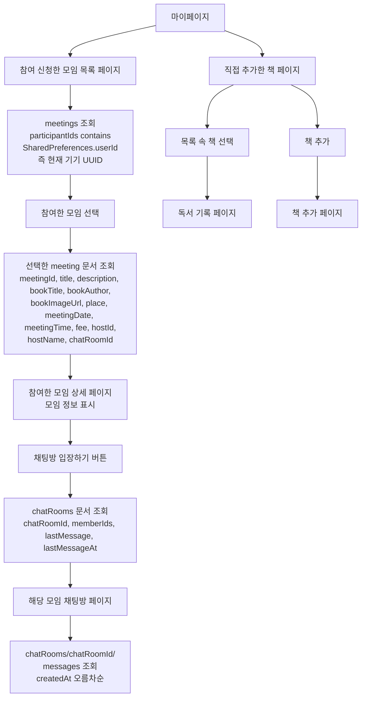

# NEW UI

# 변경사항 요약

```
기존 코드를 최대한 재사용하되, 아래 기획서 기준으로 기능을 변경한다.

0. 앱 최초 실행 시 SharedPreferences에 기기별 UUID를 생성하여 저장한다.

val prefs = context.getSharedPreferences("app", Context.MODE_PRIVATE)

var userId = prefs.getString("userId", null)

if (userId == null) {
    userId = UUID.randomUUID().toString()
    prefs.edit().putString("userId", userId).apply()
}

현재 로그인 기능이 없으므로 currentUserId는 Firebase Auth UID가 아니라 SharedPreferences.userId를 사용한다.

1. 기존 HomeScreen의 “대여 가능한 책” 영역을 “금주의 독서모임”으로 변경한다.

2. 기존 “내 책 등록” 버튼을 “모임 만들기” 버튼으로 변경한다.

3. Mock book data 대신 Firestore meetings 컬렉션 데이터를 조회해서 표시한다.
   - HomeScreen에는 createdAt 내림차순으로 모임 카드를 표시한다.
   - 홈 화면의 “더보기” 버튼을 누르면 참가 가능한 모임 목록 전체를 보여주는 화면으로 이동한다.
   - 이 화면도 meetings 컬렉션을 조회해서 표시한다.

4. 모임 만들기 화면 MeetRegScreen을 추가한다.

5. 모임 생성 시 meetings 문서와 chatRooms 문서를 생성한다.
   - meetings에는 모임 정보와 책 정보를 저장한다.
   - chatRooms에는 해당 모임의 채팅방 정보를 저장한다.
   - 생성된 chatRoomId를 meetings.chatRoomId에 저장한다.

6. MeetRegScreen에서 책 사진을 선택하면 OCR로 책 제목만 추출한다.
   - 추출된 제목은 책 제목 입력칸에 자동 입력한다.
   - 사용자는 자동 입력된 제목을 직접 수정할 수 있어야 한다.

7. 사용자가 “정보 불러오기” 버튼을 클릭하면 현재 책 제목 입력값으로 Google Books API를 호출한다.
   - API 결과로 책 후보 목록을 보여준다.
   - 사용자가 책을 선택하면 bookTitle, bookAuthor, bookImageUrl, bookDescription, bookIsbn을 자동 입력한다.

8. 책 표지 이미지는 반드시 Android DownloadManager로 다운로드한다.
   - Google Books API에서 받은 bookImageUrl을 DownloadManager로 다운로드한다.
   - 다운로드된 로컬 URI를 bookImageLocalUri로 저장한다.
   - 화면에서는 bookImageLocalUri를 우선 사용하고, 없으면 bookImageUrl을 사용한다.

9. 참가신청 시 현재 기기 UUID를 meetings.participantIds와 chatRooms.memberIds에 추가한다.
   - 현재 기기 UUID는 SharedPreferences.userId이다.
   - 처음 참가하는 경우 참가자 이름을 입력받고 SharedPreferences.displayName에 저장한다.

10. 채팅 메시지는 chatRooms/{chatRoomId}/messages/{messageId}에 저장한다.
    - senderId = SharedPreferences.userId
    - senderName = SharedPreferences.displayName
    - text = 입력 메시지
    - createdAt = serverTimestamp()

11. 메시지 렌더링은 senderId == SharedPreferences.userId 기준으로 좌우 정렬한다.
    - 내 메시지: 오른쪽 정렬
    - 상대 메시지: 왼쪽 정렬 + senderName 표시

12. 마이페이지에서는 participantIds에 SharedPreferences.userId가 포함된 meetings를 조회한다.
    - 내가 만든 모임과 내가 참가신청한 모임이 모두 표시된다.
    - 모임을 클릭하면 모임 상세 정보 화면으로 이동한다.
    - 상세 화면에서 “채팅방 입장하기” 버튼을 누르면 해당 chatRoomId의 ChatScreen으로 이동한다.
```

# 변경사항에 대한 자세한 설명 꼭 참고할 것!!!!

- 앱 최초 실행 시 기기별 UUID 를 만들어서 저장

```kotlin
val prefs = context.getSharedPreferences("app", Context.MODE_PRIVATE)

var userId = prefs.getString("userId", null)

if (userId == null) {
userId = UUID.randomUUID().toString()
prefs.edit().putString("userId", userId).apply()
}

// 즉 앱 설정 당시 currentUserId = SharedPreferences.userId 가 되는 것
```

모든 userID 는 전부 이때 만든 uuid 를 이용하는 거다!!!!!!!! 우리는 로그인 기능이 없기에 별도의 uid 가 없음!!

- offline 모임 관련 db 구조

```sql
meetings/{meetingId}
- meetingId
- title
- description

- bookTitle
- bookAuthor
- bookImageUrl
- bookDescription
- bookIsbn

- hostId
- hostName
- place
- meetingDate
- meetingTime
- fee
- maxParticipants
- participantIds: [hostUid] 
- currentParticipantsCount

- chatRoomId
- status: open / full / closed
- createdAt
- updatedAt

chatRooms/{chatRoomId}
- chatRoomId
- meetingId
- memberIds: [hostUid]
- lastMessage: ""
- lastMessageAt: null
- createdAt

chatRooms/{chatRoomId}/messages/{messageId}
- messageId
- senderId
- senderName
- text
- createdAt
```

- 메인 홈 화면 : 정승한


이 현재 사진은 바뀌기 이전 버전의 대여가능책 , 내 책 등록 , 대여가능한 책들의 리스트가 보이는 이전의 ui 임 → 이제 대여가능 책은 금주의 모임으로 , 내 책 등록은 모임 생성하기로 , 대여가능한 책들의 리스트는 금주에 참가할 수 있는 모임들의 목록으로 바뀌어야 함.



- 참가 신청 페이지 + 모임 만들기 페이지 : 정승한

## 모임 만들기 페이지



### 모임 만들기 페이지에서 입력하는 정보

[MeetRegScreen / 모임 만들기 페이지]

입력 방식:

1. 책 사진 촬영 또는 갤러리 선택
2. 로컬 이미지 인식 모델로 책 제목/텍스트 추출
3. 추출된 텍스트로 Google Books API 검색
4. 검색 결과 목록 표시
5. 사용자가 정확한 책 선택
6. 선택한 책 정보를 모임 정보에 자동 입력

```sql
// 모임이 만들어질때 DB 에 저장될 형태

meetings/{meetingId}
- meetingId
- title
- description

- bookTitle
- bookAuthor
- bookImageUrl
- bookImageLocalUri (books api 로 불러온 사진을 download manager 로 저장하고 그걸 쓸 예)
- bookDescription
- bookIsbn

- hostId
- hostName
- place
- meetingDate
- meetingTime
- fee
- maxParticipants
- participantIds: [hostUid]
- currentParticipantsCount

- chatRoomId
- status: open / full / closed
- createdAt
- updatedAt
```

모임 만들기 페이지의 입력 항목은 이렇게.

```sql
사용자 입력:
- 책 사진 (사진을 선택하면 , 제목 , 작가 , IMAGE , DESCRIPTION , ISBN이 자동으로 입력)
- 모임 제목
- 모임 설명
- 장소
- 날짜
- 시간
- 참가비
- 최대 인원

위에서 말한 AI/OCR + Google Books API 자동 입력:
- bookTitle
- bookAuthor
- bookImageUrl
- bookDescription
- bookIsbn
-> book/
		BookRecognitionModule.kt 에서 한번에 처리할 

- 날짜나 인원수 입력등은 jetpack compose library 를 이용한다
		모임 날짜
		→ DatePicker
		
		모임 시간
		→ TimePicker
		
		참가비
		→ 숫자 입력 TextField
		
		최대 인원
		→ 숫자 입력 TextField 또는 Dropdown
		
- 이런 입력값들을 싹 채우고 등록하기 버튼을 누르시면 ,
- 밑과 같이 db 의 meetings DB 내용들로 구성된 meetings 테이블의 새로운 row 가 생긴다

[사용자 직접 입력]
- title
- description
- place
- hostName
- meetingDate
- meetingTime
- fee
- maxParticipants

[BookRecognitionModule.kt 자동 입력]
- bookTitle
- bookAuthor
- bookImageUrl
- bookDescription
- bookIsbn

[시스템 자동 생성]
- meetingId: Firestore 문서 ID
- hostId: SharedPreferences userId
- participantIds: [hostId]
- currentParticipantsCount: 1
- chatRoomId: chatRooms 문서 생성 후 ID 저장
- status: "open"
- createdAt: serverTimestamp()
- updatedAt: serverTimestamp()
```

### 모임 만들때 , 책 사진 선택 후 ocr 및 api 로 자동으로 책 정보 불러오기 페이지




이런 느낌의 코드가 될 것

```
# BookRecognitionModule.kt 상세 흐름

[1] 책 사진 선택
- 사용자가 모임 만들기 페이지에서 책 사진을 선택한다.

[2] OCR 실행
- 선택한 이미지 URI를 BookRecognitionModule.kt로 전달한다.
- BookRecognitionModule.kt는 OCR을 수행하여 책 제목 후보를 추출한다.

[3] 책 제목 자동 입력
- OCR 결과로 나온 제목 후보를 책 제목 입력칸에 자동 입력한다.
- 사용자는 자동 입력된 책 제목을 직접 수정할 수 있다.

[4] 정보 불러오기 버튼 클릭
- 사용자가 "정보 불러오기" 버튼을 누르면 현재 책 제목 입력값으로 Google Books API를 호출한다.

[5] Google Books API 응답 처리
- API 응답에서 책 후보 목록을 가져온다.
- 각 후보는 다음 정보를 가진다.
  - bookTitle
  - bookAuthor
  - bookImageUrl
  - bookDescription
  - bookIsbn

[6] 책 후보 선택
- 사용자는 API 결과로 나온 책 후보 중 정확한 책을 선택한다.

[7] 표지 이미지 다운로드
- 사용자가 책을 선택하면 Google Books API에서 받은 bookImageUrl을 사용한다.
- 이때 이미지는 단순히 URL만 사용하는 것이 아니라 Android DownloadManager를 이용해 반드시 다운로드한다.
- 다운로드된 이미지의 로컬 저장 경로 또는 URI를 bookImageLocalUri로 저장한다.
- 평가 기준에 DownloadManager 사용이 포함되어 있으므로, 책 표지 이미지 다운로드는 DownloadManager를 필수로 사용한다.

[8] 책 정보 자동 입력
- 선택된 책 정보로 모임 만들기 페이지의 책 정보 입력값을 자동 채운다.
  - bookTitle
  - bookAuthor
  - bookImageUrl
  - bookImageLocalUri
  - bookDescription
  - bookIsbn
```

## 모임 참가하기 페이지


현재 사진은 바꾸기 전 버전의 책 대여와 관련된 대여상세페이지임 , 이제 이걸 모임 참가 상세 페이지로 바꿔야 함



```sql

# 채팅방 렌더링 규칙

messages.senderId == 현재 기기 UUID
→ 내 메시지이므로 오른쪽 정렬

messages.senderId != 현재 기기 UUID
→ 상대 메시지이므로 왼쪽 정렬 + messages.senderName 표시

# 채팅 메시지 전송 규칙

각 메시지 값 하나하나의 db 저장의 형태는
chatRooms/{chatRoomId}/messages/{messageId}
- messageId
- senderId
- senderName
- text
- createdAt 와 같다.

메시지를 보낼 때 현재 기기의 SharedPreferences에서 userId와 displayName을 가져온다.

Firestore messages 문서에는 다음 값을 저장한다.

- senderId = SharedPreferences.userId
- senderName = SharedPreferences.displayName
- text = 입력 메시지
- createdAt = serverTimestamp()
- messageId 는 firestore 가 알아서 만들어서 저장할 것

채팅방 렌더링 시에는 messages.senderId와 현재 기기의 userId를 비교하여 좌우 정렬한다.
상대방 이름은 messages.senderName을 그대로 표시한다.
```

## 마이페이지


현재 마이페이지에는 내가 대여한 책과 직접 추가한 책 배너가 있는데 , 직접 추가한 책 배너는 그대로 둘 것임. 중요한 것은 대여한 책이라는 배너가 참여할 모임 이라는 배너로 바뀌어야 하고 그 배너 속 목록의 내용은 책이 아니라 내가 참여하기로 한 meeting 들의 목록이 되어야 하는 것



```
1. HomeScreen 수정
- 기존: 대여 가능한 책 / 내 책 등록
- 변경: 금주의 독서모임 / 모임 만들기
- meetings DB에서 모임 목록 표시
- 모임 선택 시 ParticipateScreen 이동
- 모임 만들기 클릭 시 MeetRegScreen 이동
- 원래 ui 에서 있던 ai 추천도서 및 그 추천도서 선택 이후 돌아가는 로직들은 그대로 유지!

2. MeetRegScreen
- 새로운 모임 만드는 페이지
- 책 사진 선택
- OCR로 제목 자동 입력
- 사용자가 제목 수정 가능
- 정보 불러오기 버튼
- Google Books API 호출
- DownloadManager로 표지 이미지 다운로드
- 모임 제목, 설명, 장소, 날짜, 시간, 참가비, 최대 인원, 개설자 이름 입력
- 모임 생성하기 버튼 클릭 시 meetings / chatRooms DB를 생성한다.
- 생성 완료 후 HomeScreen으로 이동한다.
- HomeScreen의 금주의 독서모임 목록은 meetings를 createdAt 내림차순으로 조회한다.
- 따라서 방금 생성한 모임이 가장 앞에 표시된다.

3. ParticipateScreen
- 홈에서 모임 카드 클릭 시 들어가는 모임 참가 신청 화면
- meeting 정보 표시
  - 모임 제목
  - 설명
  - 책 정보
  - 개설자
  - 장소
  - 시간
  - 참가비
- 참가신청하기 버튼
- 처음 참가라면 displayName 입력 후 participantIds / memberIds에 UUID 추가
- 이후 ChatScreen 이동

4. ChatScreen
- 해당 모임의 채팅방 UI
- chatRooms/{chatRoomId}/messages 조회
- senderId == 내 UUID면 오른쪽
- 아니면 왼쪽 + senderName 표시
- 메시지 전송 시 senderId, senderName, text, createdAt 저장

5. MyPageScreen
- 내가 만든 모임 또는 내가 참가 신청한 모임 목록 표시
- 조회 기준:
  - meetings.participantIds contains SharedPreferences.userId
- 직접 추가한 책 페이지는 유지

6. JoinedMeetingDetailScreen
- 마이페이지에서 모임 클릭 시 나오는 모임 정보 화면
- meeting 상세 정보 표시
- 채팅방 입장하기 버튼
- 버튼 누르면 chatRoomId로 ChatScreen 이동
```

## Firebase / API 명세

| 번호 | 기능 | 호출 이름 | 사용 화면 | 입력값 | DB / 외부 API 작업 | 결과 |
| --- | --- | --- | --- | --- | --- | --- |
| 0 | 기기 UUID 생성 | `getOrCreateUserId()` | 앱 최초 실행 | 없음 | SharedPreferences에 `userId` 저장 | 기기별 UUID 확보 |
| 1 | 홈 모임 목록 조회 | `getWeeklyMeetings()` | HomeScreen | 없음 | `meetings` 조회, `createdAt` 내림차순 | 금주의 독서모임 목록 표시 |
| 2 | 책 사진 OCR | `extractBookTitleFromImage(imageUri)` | MeetRegScreen | `imageUri` | OCR 실행 | 책 제목 후보 자동 입력 |
| 3 | 책 정보 검색 | `searchBooksByTitle(title)` | MeetRegScreen | `title` | Google Books API 호출 | 책 후보 목록 반환 |
| 4 | 표지 이미지 다운로드 | `downloadBookImage(bookImageUrl)` | MeetRegScreen | `bookImageUrl` | Android `DownloadManager` 사용 | `bookImageLocalUri` 반환 |
| 5 | 모임 생성 | `createMeeting()` | MeetRegScreen | 모임 입력값 + 책 정보 | `meetings`, `chatRooms` 생성 | 홈으로 이동 후 새 모임 표시 |
| 6 | 모임 상세 조회 | `getMeetingDetail(meetingId)` | ParticipateScreen / JoinedMeetingDetailScreen | `meetingId` | `meetings/{meetingId}` 조회 | 모임 상세 정보 표시 |
| 7 | 모임 참가 신청 | `joinMeeting(meetingId, displayName)` | ParticipateScreen | `meetingId`, `displayName` | `participantIds`, `memberIds`에 UUID 추가 | 채팅방 이동 |
| 8 | 채팅방 정보 조회 | `getChatRoom(chatRoomId)` | ChatScreen | `chatRoomId` | `chatRooms/{chatRoomId}` 조회 | 채팅방 입장 |
| 9 | 메시지 목록 실시간 조회 | `listenMessages(chatRoomId)` | ChatScreen | `chatRoomId` | `messages` 실시간 리스너 | 채팅 목록 렌더링 |
| 10 | 메시지 전송 | `sendMessage(chatRoomId, text)` | ChatScreen | `chatRoomId`, `text` | `messages` 저장, `lastMessage` 갱신 | 메시지 전송 완료 |
| 11 | 내 모임 목록 조회 | `getMyJoinedMeetings()` | MyPageScreen | 없음 | `participantIds array-contains userId` | 내가 만든/참가한 모임 표시 |
| 12 | 마이페이지 모임 상세 | `getJoinedMeetingDetail(meetingId)` | JoinedMeetingDetailScreen | `meetingId` | `meetings/{meetingId}` 조회 | 모임 정보 표시 |

---

## 상세 명세

| 기능 | 저장 / 조회 위치 | 조건 | 저장 / 조회 필드 |
| --- | --- | --- | --- |
| 홈 모임 목록 조회 | `meetings` | `createdAt desc` | `meetingId`, `title`, `bookTitle`, `bookAuthor`, `bookImageUrl`, `bookImageLocalUri`, `place`, `meetingDate`, `meetingTime`, `fee`, `currentParticipantsCount`, `maxParticipants`, `hostName`, `chatRoomId` |
| 모임 생성 | `meetings/{meetingId}` | 모임 생성 버튼 클릭 | 사용자 입력값 + 책 자동 입력값 + 시스템 자동 생성값 |
| 채팅방 생성 | `chatRooms/{chatRoomId}` | 모임 생성 시 자동 생성 | `chatRoomId`, `meetingId`, `memberIds`, `lastMessage`, `lastMessageAt`, `createdAt` |
| 참가 신청 | `meetings/{meetingId}` | `participantIds`에 내 UUID 없을 때 | `participantIds`에 `userId` 추가, `currentParticipantsCount + 1` |
| 참가 신청 | `chatRooms/{chatRoomId}` | 참가 신청 성공 시 | `memberIds`에 `userId` 추가 |
| 메시지 조회 | `chatRooms/{chatRoomId}/messages` | `createdAt asc` | `messageId`, `senderId`, `senderName`, `text`, `createdAt` |
| 메시지 전송 | `chatRooms/{chatRoomId}/messages/{messageId}` | 전송 버튼 클릭 | `senderId`, `senderName`, `text`, `createdAt` |
| 채팅방 최신 메시지 갱신 | `chatRooms/{chatRoomId}` | 메시지 전송 후 | `lastMessage`, `lastMessageAt` |
| 내 모임 목록 조회 | `meetings` | `participantIds array-contains SharedPreferences.userId` | 내가 만든 모임 + 내가 참가한 모임 |
| 모임 상세 조회 | `meetings/{meetingId}` | 모임 카드 클릭 | 모임 상세 정보 전체 |

---

## `createMeeting()` 저장 필드

| 구분 | 필드 |
| --- | --- |
| 사용자 직접 입력 | `title`, `description`, `hostName`, `place`, `meetingDate`, `meetingTime`, `fee`, `maxParticipants` |
| OCR / Google Books API 자동 입력 | `bookTitle`, `bookAuthor`, `bookImageUrl`, `bookImageLocalUri`, `bookDescription`, `bookIsbn` |
| 시스템 자동 생성 | `meetingId`, `hostId`, `participantIds`, `currentParticipantsCount`, `chatRoomId`, `status`, `createdAt`, `updatedAt` |
| 로컬 저장 | `SharedPreferences.displayName = hostName` |

---

## 채팅 렌더링 규칙

| 조건 | UI 처리 |
| --- | --- |
| `message.senderId == SharedPreferences.userId` | 내 메시지 → 오른쪽 정렬 |
| `message.senderId != SharedPreferences.userId` | 상대 메시지 → 왼쪽 정렬 + `message.senderName` 표시 |

## 메시지 전송 규칙

| Firestore 필드 | 값 |
| --- | --- |
| `senderId` | `SharedPreferences.userId` |
| `senderName` | `SharedPreferences.displayName` |
| `text` | 사용자가 입력한 메시지 |
| `createdAt` | `serverTimestamp()` |

이 정도 표면 AI 코딩툴에 넘기기 딱 좋음.

[구현 지시용 요약본](https://app.notion.com/p/38426f5abe1180e1b0b0db18d095cf48?pvs=21)