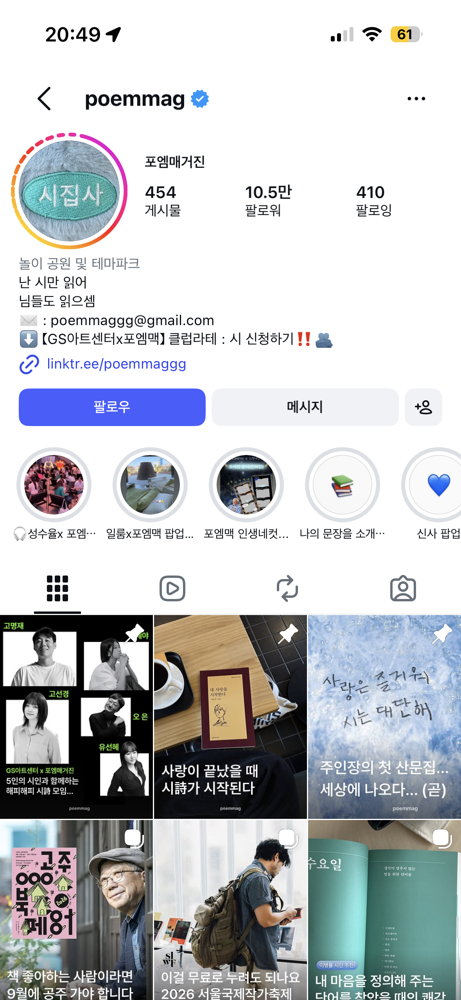
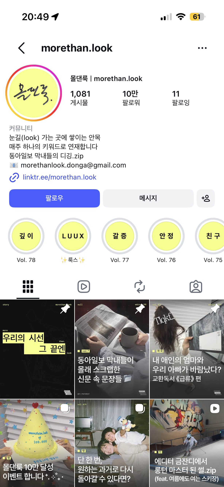
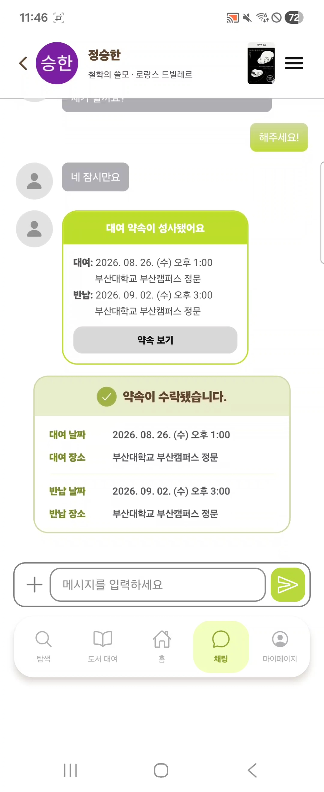
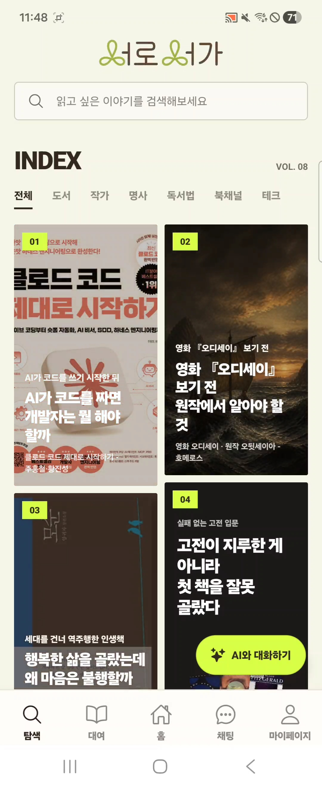
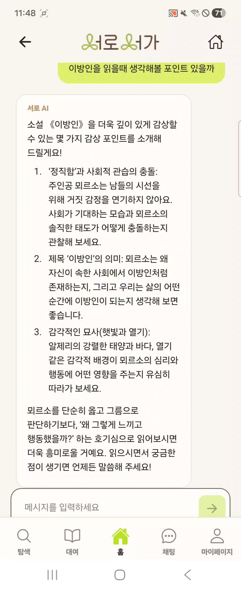
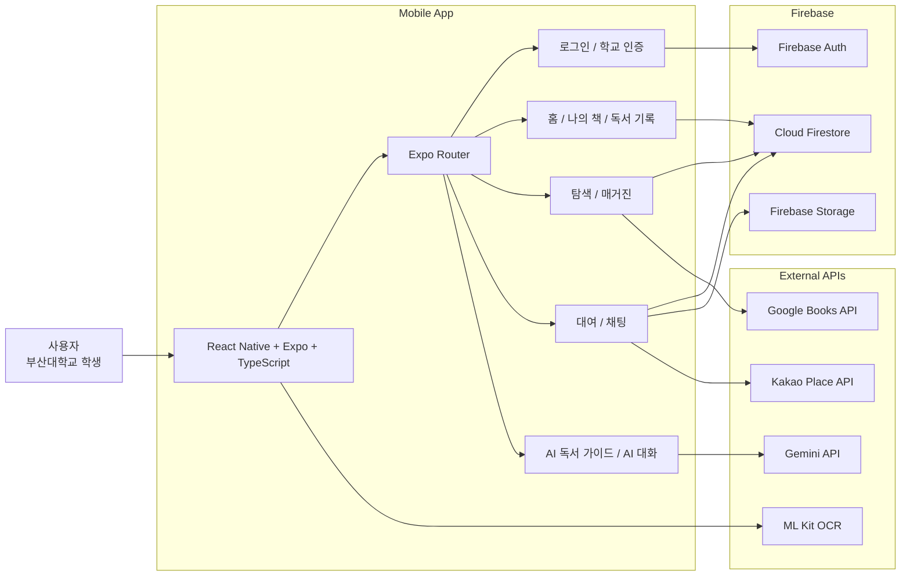
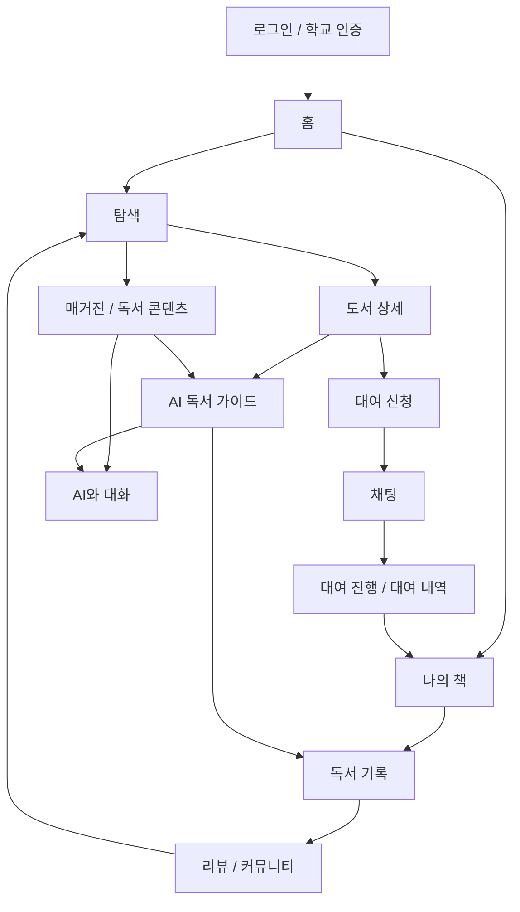
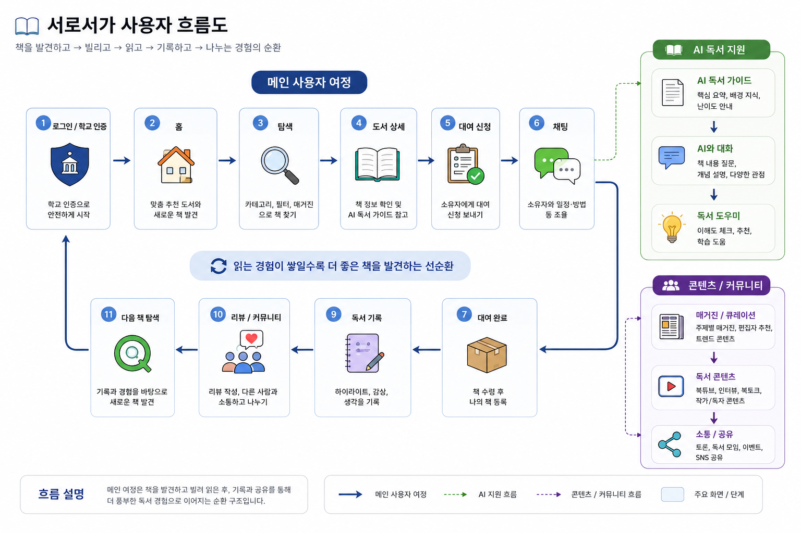

# 서로서가 (SeoroSeoga)

<p align="center">
  
</p>

> **캠퍼스 책 나눔과 AI 가이드로 독서를 더 가까이**  
> 책을 **발견하고 → 빌리고 → 읽고 → 기록하고 → 나누는 경험**을 하나의 흐름으로 연결하는 대학생 대상 캠퍼스 독서 플랫폼입니다.

- **프로젝트명**: 서로서가
- **팀명**: 알트 (Alt)
- **트랙**: 제7회 PNU 창의융합AI해커톤 · 융합트랙
- **서비스 형태**: Android 모바일 앱
- **핵심 키워드**: 캠퍼스 도서 대여 · AI 독서 가이드 · 독서 기록 · 매거진/커뮤니티 · 채팅

---

## 목차

> 💡 바쁘신 심사위원님들을 위한 3줄 요약  
>  시간 관계상 전체 내용을 보기 어려우시다면, 1,3,5번 항목을 먼저 확인해 주세요!

1. [프로젝트 소개](#1-프로젝트-소개)
2. [상세설계](#2-상세설계)
3. [개발결과](#3-개발결과)
4. [설치 및 사용 방법](#4-설치-및-사용-방법)
5. [소개 및 시연 영상](#5-소개-및-시연-영상)
6. [팀 소개](#6-팀-소개)
7. [해커톤 참여 후기](#7-해커톤-참여-후기)

---

# 1. 프로젝트 소개

## 1.1. 개발배경 및 필요성

서로서가는 다음의 문제에서 출발했습니다.

### ① 읽고 싶은 인기 도서를 원하는 시점에 빌리기 어렵다

대학 도서관은 무료 대출이라는 장점이 있지만, 인기 도서는 **보유 권수가 적거나 이미 대출·예약 중인 경우가 많아** 실제 접근성이 낮습니다.  
반대로 읽고 싶은 책을 매번 구매하는 것은 대학생에게 경제적 부담이 됩니다.

부산대학교 도서관의 실제 검색 결과에서도 **높은 관심에 비해 즉시 빌릴 수 있는 책이 없는 상황**, **소장 권수 자체가 부족한 상황**, **여러 기관에 책이 분산되어 있어도 모두 대출 중인 상황**을 확인할 수 있습니다.

<p align="center">
  
</p>
<p align="center"><sub>『프로젝트 헤일메리』: 높은 조회·대출 수요가 이어지는 가운데 소장본 세 권 모두 대출 또는 예약도서 대출 중인 사례</sub></p>

<p align="center">
  
</p>
<p align="center"><sub>『모순』: 지속적인 관심에 비해 소장본이 한 권뿐이며, 그 한 권마저 바로 빌릴 수 없는 사례</sub></p>

<p align="center">
  
</p>
<p align="center"><sub>『싯다르타』: 교내 여러 기관에 세 권이 분산 소장되어 있지만 모두 대출 불가 상태인 사례</sub></p>

서로서가는 교내에 흩어져 있는 학생들의 개인 소장 도서를 연결해, **도서관의 한계를 보완하는 캠퍼스 기반 책 공유 경로**를 만들고자 했습니다.

### ② AI·숏폼 시대, 오히려 ‘깊이 읽기’에 대한 관심은 커지고 있다

AI와 숏폼 콘텐츠의 확산으로 필요한 정보를 빠르게 얻고 요약해서 소비하는 것은 이전보다 훨씬 쉬워졌습니다. 그러나 역설적으로 긴 글을 읽고 스스로 생각하며 몰입하는 경험의 가치 역시 다시 주목받고 있습니다.

실제로 2025년 전국 공공도서관 대출량은 전년 대비 3.6% 증가했고, 한국문학 대출은 역대 최고치를 기록했습니다. 독서 플랫폼에서도 10·20대의 독서 콘텐츠 소비 증가가 두드러졌으며, 세계문학전집의 주요 독자층으로 20대가 나타나는 등 젊은 세대의 독서 관심이 다시 확대되고 있습니다.

특히 AI가 정보를 대신 정리해주는 시대가 되면서 책은 단순히 ‘정보를 얻는 수단’이 아니라 집중하고, 사고하고, 자신의 취향과 관점을 만드는 경험으로 의미가 변화하고 있습니다.

하지만 이러한 관심이 곧 실제 독서 경험으로 이어지는 것은 아닙니다. 독서에 입문하려는 대학생은 어떤 책을 읽을지 선택하고, 끝까지 읽고, 이해하고, 자신의 생각을 남기는 과정에서 여전히 높은 진입장벽을 경험합니다.

따라서 서로서가는 단순히 책을 빌려주는 서비스를 넘어, AI를 활용해 독서의 진입장벽은 낮추되 실제 읽기와 사고는 사용자가 하도록 돕는 서비스를 지향합니다.

### ③ 젊은 독자는 깊이를 거부하는 것이 아니라, 깊이에 도달할 새로운 입구를 원한다

젊은 세대의 독서 수요는 전통적인 서점 판매량이나 종이책 독서율만으로는 충분히 설명되지 않습니다. 지금의 독자는 유튜브에서 편집자의 이야기를 듣고, 인스타그램의 짧은 문장과 사회적 질문을 저장하고 공유하며, 영화·기술·경제처럼 지금 화제가 되는 주제를 통해 책을 발견합니다. 즉 **관심의 시작은 짧고 친근할 수 있지만, 그 관심이 향하는 곳은 반드시 얕지만은 않습니다.**

실제 콘텐츠 반응에서도 이러한 경향을 확인할 수 있습니다. 아래 수치는 2026년 8월 26일 공개된 유튜브 페이지를 기준으로 확인한 값입니다.

| 콘텐츠 사례 | 형식과 반응 | 확인할 수 있는 수요 |
|---|---|---|
| [「10분 겉핥기 요약으로는 이해가 어려워… 1시간 상세 리뷰: 정의란 무엇인가」](https://youtu.be/ADNGDz8EWSs) | 약 1시간 분량에도 약 **107만 회** 재생 | 단순 요약을 넘어 철학적 논점을 충분히 이해하려는 수요 |
| [「다들 10페이지 읽고 포기한 『총, 균, 쇠』」](https://youtu.be/Fc57q4CpdWQ) | 어렵기로 유명한 책을 친근한 제목과 해설로 풀어 약 **252만 회** 재생 | 난도가 높은 책도 적절한 안내가 있으면 대중적 관심으로 전환될 수 있음 |
| [「B주류초대석 박혜진 편집자」](https://youtu.be/lFQ4dVfp1pg) | 편집자와 독서 경험을 이야기하는 대화형 콘텐츠가 약 **234만 회** 재생 | 책 자체뿐 아니라 책을 고르고 만드는 사람의 관점도 강력한 발견 경로가 됨 |
| [「『노인과 바다』 오디오북」](https://youtu.be/qDnNWQBjOks) | 고전을 밤에 함께 읽는 청취 경험으로 재구성 | 독서를 혼자 수행하는 과제가 아닌 분위기와 동행의 경험으로 소비하려는 수요 |
| [「반야심경 100번 읽은 것처럼 만들어드림」](https://youtu.be/-p-wip48Lcc) | 고전 사상을 인터넷 문법과 현대적 비유로 해설 | 오래된 텍스트도 오늘의 언어로 번역하면 새로운 세대의 질문과 연결될 수 있음 |

<p align="center">
  
</p>
<p align="center"><sub>책을 만드는 편집자의 관점과 캐릭터가 독서 콘텐츠의 강력한 진입점이 된 사례</sub></p>

<p align="center">
  
</p>
<p align="center"><sub>약 1시간의 긴 해설도 높은 조회 수를 기록하며 깊이 있는 이해에 대한 수요를 보여준 사례</sub></p>

<p align="center">
  
</p>
<p align="center"><sub>고전 사상을 친근한 제목과 현대적 표현으로 재구성해 젊은 독자와 연결한 사례</sub></p>

민음사TV의 성장 역시 같은 흐름을 보여줍니다. 출판사 이름보다 책을 만드는 **편집자의 취향과 캐릭터**를 앞세우고, 세계문학 월드컵처럼 가벼운 형식으로 고전에 진입하게 한 콘텐츠가 인기를 얻었습니다. 민음사 박혜진·김민경 편집자는 이러한 콘텐츠를 두고 독자의 책에 대한 “문턱을 낮추는” 역할이라고 설명했으며, 김민경 편집자는 출판계 밖 방송까지 활동 영역을 넓히는 인물로 주목받고 있습니다. 이는 출판사의 일방적인 책 소개보다 **신뢰하는 큐레이터가 왜 지금 이 책을 읽어야 하는지 말해주는 방식**에 독자가 반응한다는 사례입니다. ([동아일보](https://www.donga.com/news/article/all/20250120/130892601/2), [매일신문](https://www.imaeil.com/page/view/2026051415494102992), [YouTube 공식 블로그](https://blog.youtube/intl/ko-kr/creator-and-artist-stories/2020_11_growwithyoutube3/))

인스타그램에서도 책과 시, 사회 이슈를 짧지만 밀도 있는 글로 편집하는 텍스트 매거진이 독립적인 콘텐츠 장르로 성장하고 있습니다.

- [포엠매거진](https://www.instagram.com/poemmag)은 흥미로운 주제와 일상의 감정을 시로 연결하며, 개설 2년 만에 팔로워 10만 명에 도달한 사례입니다. 운영자는 독자가 시를 공유하고 각자의 경험을 덧붙이는 과정에서 콘텐츠가 다시 확장된다고 설명합니다. ([문학광장 인터뷰](https://munjang.or.kr/board.es?act=view&bid=0006&c_page=1&c_type=&list_no=110354&mid=a21200000000&nPage=1&ord=), [빅이슈](https://www.bigissue.kr/magazine/new/358/3095))
- [모어댄](https://www.instagram.com/morethan.look)은 동시대 사회·문화 이슈를 짧은 글과 시각 콘텐츠로 큐레이션해, 독자가 뉴스의 표면을 넘어 맥락과 관점을 접하게 합니다.

<table>
  <tr>
    <td align="center" width="50%">
      
    </td>
    <td align="center" width="50%">
      
    </td>
  </tr>
  <tr>
    <td align="center"><sub><b>포엠매거진</b><br />책과 시를 동시대의 감정과 연결해 10만 명 이상의 독자층을 형성한 사례</sub></td>
    <td align="center"><sub><b>모어댄</b><br />책·신문·사회 이슈를 하나의 키워드로 큐레이션해 10만 명의 독자층을 형성한 사례</sub></td>
  </tr>
</table>

이 사례들만으로 모든 MZ세대가 깊이 읽기를 원한다고 단정할 수는 없습니다. 그러나 공공도서관·서점의 독서 지표와 함께, 긴 해설 영상의 높은 재생 수, 편집자 중심 북 콘텐츠의 대중화, 텍스트 매거진의 높은 팔로워와 공유 반응을 종합하면 **젊은 독자에게 깊이 있는 독서 욕구가 없기보다 그 욕구를 깨우는 발견 방식이 달라졌다는 것**을 확인할 수 있습니다.

> **MZ 독자는 깊이를 거부하지 않습니다. 깊이에 도달하는 입구가 재미없을 때 이탈합니다.**

따라서 서로서가에서 제공하는 콘텐츠 칸인 ‘탐색’은 단순한 도서 목록이 아닙니다. 영화 개봉, AI와 일자리, 주식과 금리, 관계와 젠더, 유명인의 추천처럼 지금 대화되는 주제를 매력적인 제목과 짧은 카드로 먼저 제시하고, 이를 장문 해설·역사적 맥락·토론 질문으로 확장합니다. 이후 관련 도서 대여, AI 대화, 독서 기록까지 연결해 **소셜 미디어에서 끝날 관심을 실제 독서 행동으로 전환하는 구조**를 만듭니다.

```text
유저들 사이에서 트렌디한 화제·감정·취향
  → 짧고 매력적인 탐색 카드
  → 장문 해설·역사적 맥락·토론 질문
  → 관련 책 발견 및 캠퍼스 대여
  → AI 대화·독서 기록·다음 콘텐츠 추천
```

### ④ 대여·기록·추천·커뮤니티가 서로 분리되어 있다

도서관, 전자책 구독 서비스, 온라인 서점, 중고거래 플랫폼은 각각 일부 문제를 해결하지만, 대학생의 실제 독서 흐름인

> **책 발견 → 대여 → 독서 → 기록 → 대화**

를 하나의 서비스 안에서 자연스럽게 연결하지는 못합니다.

---

## 1.2. 개발 목표 및 주요 내용

서로서가는 **“책을 구하는 과정”과 “책을 끝까지 읽는 과정”을 동시에 지원하는 것**을 목표로 합니다.

### 핵심 목표

1. **같은 캠퍼스에서 안전하게 대여**
   - 교내 개인 소장 도서를 학생 간에 연결
   - 학교 인증 기반의 신뢰 가능한 대여 환경 구성
   - 대여 신청 이후 채팅으로 자연스럽게 연결

2. **AI로 독서 진입장벽 완화**
   - 읽기 전 배경지식
   - 핵심 키워드와 이해 포인트
   - 생각을 확장하는 질문·토론 주제
   - 책 맥락을 유지한 AI 대화
   - AI 와 나눴던 대화의 저장 및 조회 기능

3. **독서 경험을 기록으로 연결**
   - 개인 소장책뿐 아니라 빌린 책, 도서관 책 등 여러 경로에서 접한 책을 하나의 독서 기록으로 통합 관리
   - 읽은 페이지와 진행률을 관리해 독서 과정을 지속적으로 기록
   - 인상 깊은 문장과 그 순간의 생각·감상을 함께 기록
   - 사라지지 않는 과거의 독서 기록을 통해 해당 책을 읽던 당시의 생각과 감정, 인상 깊었던 순간을 언제든 다시 떠올리고 되돌아볼 수 있는 개인 독서 아카이브 구축

4. **탐색과 커뮤니티를 하나의 흐름으로 연결**
   - 책에 대한 관심을 불러 일으키는 도서와 독서 관련 콘텐츠 탐색
   - 일반 매거진과 AI 독서 매거진
   - 콘텐츠를 보다가 AI와 대화하거나 책 대여로 이동

---

## 1.3. 세부내용

### 주요 사용자

| 사용자 | 해결하려는 문제 |
|---|---|
| 책을 빌리고 싶은 학생 | 도서관에 없거나 대출 중인 책을 빠르게 구하고 싶음 |
| 책을 소유한 학생 | 읽지 않는 책을 교내 학생에게 안전하게 빌려주고 싶음 |
| 독서 입문자 | 어떤 책을 읽을지 추천받고, 책을 더 쉽게 이해하고 싶음 |
| 독서 중인 학생 | 진행률, 문장, 감상과 리뷰를 기록하고 싶음 |
| 책에 대해 이야기하고 싶은 학생 | 같은 책을 읽는 사람들과 생각과 감상을 나누고 싶음 |

### 핵심 기능

### 01. 캠퍼스 도서 대여

- 부산대학교 학생 인증
- 캠퍼스 내 대여 가능 도서 확인
- 대여 신청 후 채팅으로 일정·장소 조율

<p align="center">
  
</p>
<p align="center"><sub>대여 신청 이후 채팅에서 대여·반납 일정과 장소를 조율하고 약속을 확정하는 화면</sub></p>

### 02. 탐색

**책을 찾는 기능을 넘어, 다음 독서의 진입점을 제공**

- 도서·작가·독서법 등 독서 콘텐츠 탐색
- 일반 매거진 / AI 매거진
- 콘텐츠에서 관련 도서 또는 AI 대화로 자연스럽게 이동
- **AI 기반 자체 내부 콘텐츠 제작 시스템**을 통해 사용자의 순간적인 관심을 지속적인 독서로 전환

<table>
  <tr>
    <td align="center" width="50%">
      
    </td>
    <td align="center" width="50%">
      
    </td>
  </tr>
  <tr>
    <td align="center"><sub><b>트렌드 기반 발견</b><br />도서·작가·독서법·테크 등 다양한 관심사에서 다음 책을 발견</sub></td>
    <td align="center"><sub><b>깊이 있는 콘텐츠로 전환</b><br />영화의 화제를 원작의 맥락·질문·장문 콘텐츠로 확장</sub></td>
  </tr>
</table>

서로서가는 매거진을 외부에서 공급받거나 일회성으로 작성하는 데 그치지 않고, **트렌드 탐색부터 출처 기반 리서치, 콘텐츠 구조화, 인간 검수, 앱 발행까지 반복할 수 있는 자체 제작 시스템**을 구축했습니다. 이 시스템은 AI에게 글 한 편을 통째로 맡기는 방식이 아니라, AI의 탐색·연결·구조화 능력과 사람의 편집 관점·사실 검증을 결합한 내부 운영 모델입니다.

#### AI 기반 자체 내부 콘텐츠 제작 시스템

```text
문화·기술·경제·사회 트렌드와 사용자 관심 신호
  → 신뢰 가능한 출처 묶음 구성
  → AI가 “왜 지금 이 책인가”라는 편집 각도 제안
  → 훅·장문·토론 질문·역사적 맥락을 매거진 형식으로 구조화
  → 사람의 사실·저작권·균형 검수
  → 탐색 카드와 상세 콘텐츠 발행
  → 관련 도서 대여·AI 대화·독서 기록으로 연결
```

#### 트렌디한 관심을 깊이 있는 독서로 전환

 서로서가는 MZ세대에게 **지금의 화제를 놓치고 싶지 않은 욕구**와 **그 이면의 맥락을 깊이 이해하고 싶은 욕구**가 함께 있다고 봅니다.

탐색 첫 화면에서는 영화, AI, 주식, 관계, 사회 이슈처럼 익숙하고 시의성 있는 언어로 시선을 끕니다. 상세 화면에서는 이를 장문 해설, 역사적 배경, 찬반 토론거리로 확장하고, 관심이 생긴 즉시 관련 책 대여와 AI 대화로 이동시킵니다. 따라서 짧은 훅은 소비의 끝이 아니라 **실제 책의 첫 페이지로 이동시키는 입구**가 됩니다.

| 구현 사례 | 트렌드와 책을 연결한 방식 |
|---|---|
| 양귀자 『모순』 | 오래된 소설을 오늘날 청년의 사랑·안정·커리어 선택 문제로 재해석 |
| 호메로스 『오디세이아』 | 영화 『오디세이』의 화제를 원작의 귀환·정체성·영웅성에 관한 질문으로 연결 |
| 『클로드 코드 제대로 시작하기』 | AI 코딩 도구의 관심을 개발자의 역할·책임·교육 변화에 관한 독서로 확장 |

#### 사용자 반응이 다시 콘텐츠가 되는 운영 모델

이 운영 모델 자체가 서로서가의 **AI 기반 자체 내부 콘텐츠 제작 시스템**입니다. 현재 구축한 제작 파이프라인을 기반으로, 운영 단계에서는 탐색 카드 선택, 상세 콘텐츠 체류, 토론·AI 대화 진입, 관련 도서 조회와 대여 신청 같은 반응을 관심 신호로 활용할 수 있습니다. AI는 이 신호와 새로운 트렌드를 함께 분석해 다음 주제와 편집 각도의 후보를 제안하고, 사람은 발행 우선순위와 사실성을 최종 판단합니다.

이를 통해 특정 장르나 유행에 머물지 않고 문학·영화·기술·경제·과학·캠퍼스 이슈로 매거진을 계속 확장할 수 있습니다. 콘텐츠가 늘어날수록 단순히 글의 수만 많아지는 것이 아니라, **어떤 관심이 실제 도서 조회·대여·기록으로 이어졌는지 학습하며 더 정교한 독서 진입점을 만드는 구조**입니다.

### 03. AI 독서 지원

**요약으로 책을 대체하지 않고, 읽기 전·읽는 중 필요한 맥락을 제공**

- 책의 배경지식·핵심 키워드·이해 포인트 제공
- 선택한 책 또는 매거진 맥락을 유지한 AI 대화
- 읽는 과정에서 생기는 질문을 바로 해결

<p align="center">
  
</p>
<p align="center"><sub>선택한 책의 맥락을 유지하며 감상 포인트와 읽는 중 생긴 질문을 지원하는 AI 대화 화면</sub></p>

---

## 1.4. 기존 서비스 대비 차별성

| 구분 | 기존 서비스의 한계 | 서로서가 |
|---|---|---|
| 대학 도서관 | 인기 도서의 수요 대비 보유 권수 한계, 복잡한 접근 경로 | 교내 개인 소장 도서를 새로운 공유 자원으로 연결 |
| 전자책 구독 서비스 | 정기 구독 비용, 전자책 중심 | 같은 학교 학생의 **실물 종이책** 공유 + 독서 입문 지원 |
| 온라인 서점 | 구매와 리뷰 중심 | 대여부터 기록·AI·커뮤니티까지 독서 경험 전체 지원 |
| 중고거래 플랫폼 | 거래가 끝나면 독서 경험과 단절 | 학교 인증 기반 대여 후 **읽기와 기록**까지 연결 |
| 일반 AI 챗봇 | 사용자가 맥락을 직접 설명해야 함 | 선택한 책과 콘텐츠의 맥락 안에서 독서 질문과 대화 연결 |

서로서가의 핵심 차별점은 기능의 개수가 아니라, 
**대학생의 취향을 겨냥한 매거진을 통해 책에 대한 관심을 불러일으키는 것부터, 책을 발견하고, 빌려 읽고, 기록하고, 다른 사람과 생각을 나누는 독서의 전 과정을 하나의 플랫폼에서 경험할 수 있다**는 점입니다.

```text
발견 → 캠퍼스 대여 → 읽기 전 AI 가이드 → 독서 → 기록 → 리뷰/대화 → 다음 책 발견
```

해당 경험의 흐름을 한번에 제공하는 독서 플랫폼은 서로서가를 제외하면 존재하지 않습니다.

---

## 1.5. 사회적가치 도입 계획

### 대학 내 유휴 도서의 공유 자원화

개인 책장에 머물던 책을 캠퍼스 안에서 다시 순환시켜, 동일한 책을 새로 구매해야 하는 부담을 줄이고 **기존 자원의 활용도를 높입니다.**

### 독서 접근성 향상

도서관에서 당장 빌릴 수 없는 인기 도서에도 새로운 접근 경로를 제공해, 학생들이 책을 읽고 싶다는 관심을 실제 행동으로 옮기기 쉽게 만듭니다.

### 청년 독서문화 활성화

단순 대여 중개에 그치지 않고 AI 가이드, 독서 기록, 매거진, 리뷰와 대화를 연결하여 **독서가 개인의 일회성 행동이 아니라 캠퍼스 문화로 이어지도록** 설계합니다.

### 신뢰 가능한 교내 대여 구조 고도화

MVP에서는 학교 인증과 대여 이력 기반으로 신뢰 구조를 만들고, 향후에는 다음 기능을 도입할 계획입니다.

- 신고 및 분쟁 대응
- 사용자 신뢰도/매너 지표
- 소액 보증금 또는 안전결제 구조
- 미반납·훼손·분실 대응 정책

### 확장 가능성

부산대학교에서 MVP를 검증한 뒤 부산 지역 대학, 나아가 전국 대학으로 확장할 수 있습니다.  
상용화 시에는 대여 중개 수수료, 프리미엄 AI 기능, 지역 서점 제휴 등을 수익 모델로 검토할 수 있습니다.

---

# 2. 상세설계

## 2.1. 시스템 구성도



### 구조 설계 원칙

- `app/`의 Expo Router 화면 구조를 중심으로 홈, 탐색, 대여, 채팅, 기록 흐름을 연결
- Firebase 접근 로직은 `services/*Repository.ts` 계층으로 분리해 화면 코드와 데이터 저장 로직을 구분
- 화면별 데이터 조회와 상태 관리는 `hooks/`로 분리해 재사용 가능한 로직으로 구성
- 공통 데이터 타입은 `models/`, 보조 타입은 `types/`에 분리해 기능 간 계약을 명확히 유지
- Gemini, Google Books, Kakao Place, OCR 등 외부 기능은 `services/` 계층에서 캡슐화

---

## 2.2. 사용 기술

### Frontend

| 기술 | 용도 |
|---|---|
| React Native | 모바일 앱 UI 및 기능 구현 |
| Expo | Android 개발·실행 환경 |
| TypeScript | 프론트엔드 개발 언어 |
| Figma | UI/UX 설계 및 프로토타이핑 |

### Backend / Cloud / Data

| 기술 | 용도 |
|---|---|
| Firebase Auth | 이메일/Google 로그인 및 학교 이메일 기반 사용자 인증 |
| Cloud Firestore | 책, 대여, 채팅, 독서 기록, AI 대화 데이터 저장 |
| Firebase Storage | 로컬 이미지 URI를 업로드해 전역 접근 가능한 다운로드 URL로 변환하고, 책 표지·채팅 이미지를 저장 |
| Firebase Security Rules | Firestore 및 Storage 접근 권한 제어 |
| Google Sign-In | Google 계정 기반 로그인 연동 |

### AI

| 기술 | 용도 |
|---|---|
| Gemini API | 책 맥락 기반 AI 독서 가이드·대화 기능 |
| Google Books API | 도서 검색 및 책 메타데이터 보조 |
| Kakao Place API | 대여 장소 검색 및 선택 보조 |
| ML Kit OCR | 책 표지나 텍스트 이미지에서 도서 정보 입력 보조 |
| ChatGPT | 요구사항 정리, 구조 설계, 문서화, 기획 검토 |
| Gemini | 기획/구조 검토 및 생성형 AI 기능 실험 |
| Figma AI | UI/UX 시안 탐색 및 화면 설계 보조 |
| Codex | 코드 생성, 수정, 리팩터링 및 프로젝트 맥락 기반 개발 보조 |

### Collaboration

| 기술 | 용도 |
|---|---|
| Git / GitHub | 버전 관리 및 협업 |
| GitHub Issues / PR | 작업 단위 관리 및 코드 리뷰 |
| Notion | 기능 명세·기획 문서 관리 |

---

# 3. 개발결과

## 3.1. 전체시스템 흐름도



### 핵심 사용자 여정

<p align="center">
  
</p>

> 💡 **한눈에 보는 사용자 여정 요약**
> * **안전한 시작과 매칭**: 학교 인증 후 취향 맞춤 도서를 탐색하고, 소유자에게 대여를 신청하여 매칭을 진행합니다.
> * **독서 경험 극대화**: 도서 상세 정보를 확인할 때는 AI 독서 가이드의 도움을 받고, 대여 후에는 독서 기록과 커뮤니티 소통을 즐깁니다.
> * **선순환 구조**: 축적된 독서 데이터와 경험을 바탕으로 다음 책을 추천받고 발견하는 지속 가능한 선순환 여정을 완성합니다.

```text
로그인
  ↓
홈에서 캠퍼스의 책 발견, 탐색에서 흥미로운 책 발견
  ↓
도서 상세 확인
  ↓
대여 신청
  ↓
채팅에서 일정·전달 방식 조율
  ↓
나의 책에 추가
  ↓
AI 가이드와 함께 독서
  ↓
진행률·문장·감상 기록
  ↓
리뷰/매거진/커뮤니티로 생각 공유
```

---

## 3.2. 기능설명

### 3.2.1. 로그인 / 학생 인증

**입력**

- 부산대학교 이메일 등 회원 인증 정보

**동작 및 결과**

- 학교 구성원 여부를 확인합니다.
- 인증된 사용자는 홈 화면으로 이동합니다.
- 캠퍼스 내부 대여라는 서비스 특성상 사용자 신뢰 구조의 첫 단계로 활용합니다.

---

### 3.2.2. 홈

**입력**

- 책 카드 선택
- 책장 가로 스크롤
- `+` 카드 선택
- 전체보기 선택

**동작 및 결과**

- 빌린 책과 나의 책을 책장 형태로 확인합니다.
- 책 카드를 선택하면 해당 책의 상세/기록 화면으로 이동합니다.
- `+` 카드를 통해 새로운 책 탐색 또는 책 등록 흐름으로 진입합니다.
- 책장은 가로 스크롤을 지원하여 실제 서가를 둘러보는 경험을 강화합니다.

---

### 3.2.3. 탐색

**입력**

- 도서/작가/독서법 콘텐츠 선택
- 매거진 카드 선택
- 검색·필터·카드 탐색

**동작 및 결과**

- 캠퍼스에서 빌릴 수 있는 책과 다양한 독서 콘텐츠를 한곳에서 탐색합니다.
- 일반 매거진은 콘텐츠 소비와 커뮤니티 대화로 연결됩니다.
- AI 매거진은 콘텐츠 맥락을 유지한 채 AI와 대화하거나 관련 도서 대여 흐름으로 이동할 수 있습니다.

---

### 3.2.4. 도서 대여

**입력**

- 대여 가능한 도서 선택
- `대여 신청하기` 선택
- 대여 조건 확인

**동작 및 결과**

- 책의 소유자와 대여 조건을 확인합니다.
- 대여 신청 후 채팅 탭으로 이동하고, 해당 대여 건의 대화를 이어갈 수 있습니다.
- 대여 중인 책은 대여 내역에서 상태를 확인할 수 있습니다.

---

### 3.2.5. 채팅

**입력**

- 텍스트 메시지
- 하단 `+` 버튼을 통한 사진·카메라·위치 등 보조 입력
- 상단 메뉴를 통한 대여 관련 정보 확인

**동작 및 결과**

- 대여자와 소유자가 책 전달 일정과 장소 등을 조율합니다.
- 대여와 관련된 상태/정보는 별도의 시트 형태로 확인할 수 있도록 구성합니다.

---

### 3.2.6. AI 독서 가이드

**입력**

- 읽고 싶은 책 선택
- 가이드 콘텐츠 선택
- 책에 대한 질문 입력

**동작 및 결과**

AI가 책 전체를 대신하는 요약본이 아니라 **실제 독서를 돕는 보조 가이드**를 제공합니다.

- 읽기 전 알아두면 좋은 배경지식
- 핵심 키워드
- 이해를 돕는 주요 포인트
- 생각을 확장하는 질문
- 토론 주제
- 책 맥락을 기반으로 한 AI 대화

---

### 3.2.7. 나의 책 / 독서 기록

**입력**

- 책 등록
- 현재 읽은 페이지
- 인상 깊은 문장
- 감상 및 리뷰

**동작 및 결과**

- 개인 소장책뿐 아니라 대여한 책이나 도서관에서 빌린 책도 기록 대상으로 관리할 수 있습니다.
- 현재 페이지를 기준으로 독서 진행률을 확인합니다.
- 책마다 문장·감상·리뷰를 누적해 개인 독서 아카이브를 만듭니다.

---

### 3.2.8. 매거진 / 리뷰

**입력**

- 매거진 선택
- AI 대화 또는 관련 책 이동

**동작 및 결과**

- 책뿐만 아니라 작가, 독서법 등 다양한 독서 콘텐츠를 탐색합니다.
- 콘텐츠 탐색이 다음 독서와 대여로 이어지는 순환 구조를 만듭니다.

---

## 3.3. 기능명세서

| ID | 기능 | 주요 입력 | 주요 결과 |
|---|---|---|---|
| AUTH-01 | 학교 인증 | 학교 이메일/인증 정보 | 인증 사용자 생성 및 로그인 |
| HOME-01 | 홈 책장 | 스크롤, 카드 선택 | 빌린 책·나의 책 탐색 |
| BOOK-01 | 책 등록 | 책 정보 | 나의 책에 도서 추가 |
| BOOK-02 | 책 탐색 | 검색/카드 선택 | 도서 상세 확인 |
| RENT-01 | 대여 신청 | 대상 도서, 대여 요청 | 대여 요청 생성 및 채팅 연결 |
| RENT-02 | 대여 내역 | 대여 상태 | 진행 중/완료 대여 확인 |
| CHAT-01 | 대여 채팅 | 메시지, 첨부 | 사용자 간 대여 조율 |
| AI-01 | AI 독서 가이드 | 선택 도서 | 배경지식·키워드·질문 제공 |
| AI-02 | AI 대화 | 사용자 질문 | 책 맥락 기반 답변 |
| RECORD-01 | 진행률 기록 | 현재 페이지 | 독서 진행률 저장 |
| RECORD-02 | 문장/감상 기록 | 문장, 감상 | 책별 독서 기록 저장 |
| EXPLORE-01 | 탐색 | 콘텐츠 선택 | 도서·작가·독서법 탐색 |
| MAG-01 | 매거진 | 매거진 선택 | 콘텐츠 열람 및 커뮤니티 연결 |
| MAG-02 | AI 매거진 | 질문/CTA 선택 | AI 대화 또는 관련 도서 대여 이동 |
| USER-01 | 마이페이지 | 프로필/설정 입력 | 사용자 정보·설정 관리 |

> 별도 Notion/PDF 기능명세서가 있는 경우 이 표와 함께 `docs/` 폴더에 첨부할 수 있습니다.

---

## 3.4. 디렉토리 구조

아래는 실제 프로젝트 구현 기준의 주요 디렉토리 구조입니다.  
`node_modules/`, `.expo/` 등 설치·실행 과정에서 생성되는 로컬 폴더는 제외했습니다.

```text
.
├── app/                       # Expo Router 기반 화면/라우트
│   ├── (tabs)/                # 하단 탭 라우트
│   │   ├── home/              # 홈, 책 상세, 독서 기록, AI 화면
│   │   ├── explore/           # 탐색, 매거진 상세
│   │   ├── rental/            # 대여 홈, 빌릴래요, 빌려줄래요
│   │   ├── community.tsx      # 커뮤니티 화면
│   │   └── mypage.tsx         # 마이페이지
│   ├── chat/                  # 채팅 상세 화면
│   ├── login.tsx              # 로그인
│   ├── profile-edit.tsx       # 프로필 수정
│   └── _layout.tsx            # 앱 공통 레이아웃
├── auth/                      # Firebase Auth 기반 인증 컨텍스트
├── components/                # 공통 UI 컴포넌트
├── screens/                   # 일부 라우트에서 재사용하는 화면 컴포넌트
├── hooks/                     # 화면별 데이터 조회 및 상태 로직
├── services/                  # Firebase/외부 API 연동 Repository 및 Service
├── models/                    # 도메인 모델 타입
├── data/                      # 초기/샘플 데이터
├── lib/                       # Firebase 초기화 등 공통 라이브러리
├── constants/                 # 테마 등 공통 상수
├── utils/                     # 유틸 함수
├── types/                     # 보조 타입 선언
├── assets/                    # 앱 이미지 리소스
├── docs/
│   ├── 소설실_발표자료/       # 발표자료 및 실행 화면 자료
│   └── 해커톤예선_자료/       # 참가 신청서 및 예선 발표 자료
├── pictures/                  # README 및 발표용 이미지 자료
├── Flow/                      # 사용자 흐름 정리 문서
├── firestore.rules            # Firestore 보안 규칙
├── storage.rules              # Firebase Storage 보안 규칙
├── firebase.json              # Firebase 설정
├── app.json                   # Expo 앱 설정
├── package.json               # npm 스크립트 및 의존성
└── README.md
```

---

# 4. 설치 및 사용 방법

서로서가는 별도 `backend/` 서버를 실행하는 구조가 아니라, Expo React Native 앱에서 Firebase와 외부 API를 연동하는 모바일 앱입니다.  
Android 테스트는 native Google Sign-In과 OCR 모듈을 포함하기 위해 Expo Go가 아닌 **EAS development build APK + expo-dev-client** 기준으로 진행합니다.

## 4.1. 요구 환경

- Node.js 20 LTS 이상 권장
- npm
- Android 기기 또는 Android Emulator
- Expo 계정 및 EAS CLI
- Firebase 프로젝트
- Git

---

## 4.2. 프로젝트 설치

```bash
git clone <REPOSITORY_URL>
cd <REPOSITORY_NAME>

npm install
```

---

## 4.3. 환경변수 설정

프로젝트 루트의 `.env` 또는 `.env.local`에 Firebase, Google 로그인, 외부 API 키를 설정합니다.  
공유용 키 목록은 `.env.example`을 기준으로 확인할 수 있으며, 공개 저장소에는 `.env.example`만 공유합니다.  
기존 팀 프로젝트 권한이 없는 환경에서 실행하는 경우에는 5.4의 프로젝트 설정 교체를 먼저 진행한 뒤, 새 Firebase 프로젝트 기준의 값을 입력합니다.

`.env` 또는 `.env.local`

```env
EXPO_PUBLIC_FIREBASE_API_KEY=
EXPO_PUBLIC_FIREBASE_AUTH_DOMAIN=
EXPO_PUBLIC_FIREBASE_PROJECT_ID=
EXPO_PUBLIC_FIREBASE_STORAGE_BUCKET=
EXPO_PUBLIC_FIREBASE_MESSAGING_SENDER_ID=
EXPO_PUBLIC_FIREBASE_APP_ID=

EXPO_PUBLIC_GOOGLE_WEB_CLIENT_ID=

EXPO_PUBLIC_GEMINI_API_KEY=
EXPO_PUBLIC_GEMINI_MODEL=

EXPO_PUBLIC_GOOGLE_BOOKS_API_KEY=
EXPO_PUBLIC_KAKAO_REST_API_KEY=
```

> 실제 키 값은 Git에 커밋하지 않습니다.

---

## 4.4. Expo/Firebase 프로젝트 설정 교체

이 프로젝트의 EAS development build를 그대로 생성하려면 기존 Expo/EAS 프로젝트 권한이 필요합니다.  
권한이 없는 경우에는 본인 Expo 계정과 Firebase 프로젝트를 새로 만든 뒤, 아래 설정값을 자신의 프로젝트 기준으로 교체해 실행할 수 있습니다.

### 4.4.1. Expo 앱 설정 교체

`app.json`에서 새 Expo/EAS 프로젝트 기준으로 다음 값을 교체합니다.

```json
{
  "expo": {
    "name": "새 앱 이름",
    "slug": "새 Expo slug",
    "scheme": "새 앱 scheme",
    "owner": "본인 Expo 계정 또는 조직",
    "android": {
      "package": "com.example.app",
      "googleServicesFile": "./google-services.json"
    },
    "ios": {
      "bundleIdentifier": "com.example.app"
    },
    "extra": {
      "eas": {
        "projectId": "새 EAS project id"
      }
    }
  }
}
```

새 EAS 프로젝트를 연결할 때는 본인 Expo 계정으로 로그인한 뒤 EAS 프로젝트를 다시 초기화합니다.

```bash
npx.cmd eas-cli login
npx.cmd eas-cli init
```

### 4.4.2. Firebase 설정 교체

Firebase Console에서 새 프로젝트를 만든 뒤 다음 기능을 활성화합니다.

- Authentication
- Google 로그인 provider
- Cloud Firestore
- Firebase Storage

그 다음 Android 앱을 새로 등록하고, 등록한 Android package name이 `app.json`의 `expo.android.package`와 일치하도록 설정합니다.  
Firebase에서 내려받은 새 `google-services.json` 파일은 프로젝트 루트의 기존 파일과 교체합니다.

Google 로그인까지 동작시키려면 EAS development build에 사용되는 Android 서명 인증서의 SHA-1, SHA-256 fingerprint를 Firebase Android 앱에 등록해야 합니다.

환경변수는 5.3의 목록을 새 Firebase 프로젝트와 외부 API 기준으로 다시 입력합니다.

---

## 4.5. Android development build 설치

native Google Sign-In, ML Kit OCR 등 네이티브 모듈을 포함하므로 Android 테스트는 development build APK를 설치한 뒤 진행합니다.

```bash
npx.cmd eas-cli login
npx.cmd --yes eas-cli build --platform android --profile development
```

빌드가 끝나면 EAS가 출력하는 설치 링크 또는 QR 코드를 통해 Android 기기에 APK를 설치합니다.

---

## 4.6. 앱 실행

설치된 development build 앱을 대상으로 Metro 서버를 실행합니다.

```bash
npm run start:dev-client
```

Android 기기에서는 Expo Go가 아니라 설치된 `seoroseoga` 앱을 열어 Metro에 연결합니다.

---

## 4.7. 개발 중 확인 명령

```bash
npm run typecheck
npm run lint
```

JS/TS 화면 코드만 변경한 경우에는 보통 새 APK 빌드 없이 `npm run start:dev-client`를 다시 실행하거나 Metro를 새로고침하면 됩니다.  
반대로 native dependency, Expo config plugin, `app.json`, `eas.json`, `google-services.json` 등이 변경된 경우에는 새 development build가 필요합니다.

Firebase 설정 파일인 `google-services.json`은 프로젝트 루트에 위치해야 하며, `app.json`의 Android 설정에서 참조합니다.

---

# 5. 소개 및 시연 영상

## 프로젝트 소개 영상

대회 운영 측에 영상을 제출한 뒤 부여받은 YouTube URL을 연결합니다.

- **YouTube**: [🎬 제7회 PNU 창의융합AI해커톤 시연 영상 보러가기](https://www.youtube.com/watch?v=9uO-5PCK8uc)

## 시연에서 확인할 핵심 흐름

1. 로그인 / 학교 인증
2. 홈에서 책 탐색
3. 도서 상세 → 대여 신청
4. 채팅을 통한 대여 조율
5. 나의 책에서 대여 도서 확인
6. AI 독서 가이드 및 AI 대화
7. 독서 진행률·문장·감상 기록
8. 매거진/커뮤니티 탐색

---

# 6. 팀 소개

## Team Alt

| 이름 | 역할                             | 주요 담당                                          |
|---|--------------------------------|------------------------------------------------|
| **김민주** | 팀장 / Frontend, Backend · 기획 총괄 | 프로젝트 구조 조율, 백엔드, 기획 및 산출물 총괄                   |
| **정승한** | AI / Backend                   | AI 기능 및 백엔드 구현, 기술 구조 검토                       |
| **신지은** | 디자이너/UI.UX                     | 서비스 브랜딩, UI/UX 설계, 인터랙션 및 프론트엔드                |
| **이규원** | Planning , AI / Backend                    | AI 기능 및 백엔드 구현, 시장조사, 경쟁 서비스 분석, 아이디어 구체화 및 기획 |


---

# 7. 해커톤 참여 후기

### 김민주

머릿속으로 생각했던 아이디어를 직접 앱으로 현실화할 수 있다는 생각에 설렘으로 시작하게 되었습니다. AI 시대는 큰 지식, 많은 기술자 없이도 아이디어를 실현할 수 있다는 점이 큰 매력인 것 같습니다.
팀장으로서 프로젝트를 이끌면서, 과거의 프로젝트 경험에서 고수했던 협업 방식이 아닌, AI 시대에 적합한 협업 방식을 채택하고 팀원들을 조율하는 과정에서 많은 것을 배울 수 있었습니다.
변해가는 개발 세계에 CSE 전공자로서 어떻게 나아가야할 지 고민해 볼 수 있는 좋은 시간이었습니다.

### 정승한

개인적으로는 사실 이번 개발의 목표가 코딩을 단 한 줄도 하지 않겠다는 것이었습니다. 구조를 설계하거나 , 규칙을 정의하고 , 프로젝트의 일관성을 유지하는 것에 거의 모든 신경을 쓴 것 같습니다. 코딩의 해가 저무는 시점에서 이 프로젝트가 새로운 개발자의 영역을 느끼게 해준 것 같아 좋으면서도 과거의 코딩 때문에 힘들어 하던 기억이 없어지며 조금은 허무한 감도 있습니다. 그러나 그 만큼 더 개발자로써 개발만 신경 쓰는 것이 아닌 서비스에 더 밀접하게 다가갈 수 있기도 했습니다.
그러면서 느꼈던 건 AI 기능을 서비스에 넣는 것 자체보다, 어떤 시점에 어떤 맥락을 제공해야 실제 사용자의 독서를 돕는 지가 더 중요했습니다. 개발을 위해 세운 규칙에 따라 AI와 백엔드 기능을 독립 모듈로 나누고 기능 간 계약을 명확히 하는 과정이 유지보수와 협업에 도움이 되었습니다.

### 신지은

UI/UX에서는 화면 하나의 완성도보다 홈·탐색·대여·채팅·기록 사이의 연결성이 더 중요했습니다. Figma와 생성형 AI를 반복적으로 활용하면서도 결과물을 그대로 사용하는 대신 디자인 시스템과 사용자 흐름을 기준으로 재검토하는 과정의 필요성을 확인했습니다.

### 이규원

시장조사와 경쟁 서비스 분석을 통해 단순히 기능을 많이 추가하는 것보다, 실제 대학생이 겪는 도서 접근성과 독서 지속 문제를 명확히 정의하는 것에 신경을 많이 썼습니다. 비개발 관점의 문제 정의가 개발 우선순위를 정하는 데에도 직접적으로 연결될 수 있음을 확인하였고 비전공자로서 개발과 비개발의 중간 위치에 있다는 불안함이 있었지만 팀원들의 우수한 역량 덕에 참 많은 것을 배운 것 같아요 팀원 분들께 감사합니다.

---

## 참고 자료

- 문화체육관광부, 「2025년 국민독서실태조사」
- 권이은(2021), 「대학생의 독서 실태와 인식 조사」, 『국어교육학연구』 56(3), 5-34
- 제7회 PNU 창의융합AI해커톤 참가신청서 및 개발계획서
- 서로서가 발표자료 및 UI/UX 프로토타입
- 문화체육관광부, [제4차 독서문화진흥 기본계획(2024–2028)](https://mcst.go.kr/servlets/eduport/front/upload/UplDownloadFile?pFileName=%EC%A0%9C4%EC%B0%A8%EB%8F%85%EC%84%9C%EB%AC%B8%ED%99%94%EC%A7%84%ED%9D%A5%EA%B8%B0%EB%B3%B8%EA%B3%84%ED%9A%8D%282024-2028%29.pdf&pPath=0417000000&pRealName=DEPTDATA_20240418101610603580.pdf)
- 예스24 채널예스, [2025년 베스트셀러 동향과 출판계 트렌드는?](https://ch.yes24.com/Article/Details/81752)
- The Publishers Association, [The BookTok Generation](https://www.publishers.org.uk/the-booktok-generation-how-social-media-is-transforming-gen-z-reading-habits/)
- TikTok Newsroom, [#BookTok community helps sell more than 50 million books across Europe](https://newsroom.tiktok.com/booktok-community-50-million-books?lang=en-150)
- YouTube, [B주류초대석 박혜진 편집자](https://youtu.be/lFQ4dVfp1pg)
- YouTube, [10분 겉핥기 요약으로는 이해가 어려워: 『정의란 무엇인가』 1시간 상세 리뷰](https://youtu.be/ADNGDz8EWSs)
- YouTube, [잠 안 오는 밤, 고요하게 함께 책 읽어요: 『노인과 바다』 오디오북](https://youtu.be/qDnNWQBjOks)
- YouTube, [반야심경 100번 읽은 것처럼 만들어드림](https://youtu.be/-p-wip48Lcc)
- YouTube, [다들 10페이지 읽고 포기한 『총, 균, 쇠』](https://youtu.be/Fc57q4CpdWQ)
- 동아일보, [책 좋아하는 두 편집자의 ‘세계문학 월드컵’](https://www.donga.com/news/article/all/20250120/130892601/2)
- 매일신문, [출판계 셀럽으로 주목받는 김민경 편집자](https://www.imaeil.com/page/view/2026051415494102992)
- YouTube 공식 블로그, [민음사TV가 출판사의 이야기를 전하는 방식](https://blog.youtube/intl/ko-kr/creator-and-artist-stories/2020_11_growwithyoutube3/)
- 문학광장, [포엠매거진 최정예 대표 인터뷰](https://munjang.or.kr/board.es?act=view&bid=0006&c_page=1&c_type=&list_no=110354&mid=a21200000000&nPage=1&ord=)
- 빅이슈, [텍스트힙과 인스타그램 텍스트 매거진](https://www.bigissue.kr/magazine/new/358/3095)
- 북럼, [유스북스 브랜드 소개](https://bookrum.co.kr/brands/youthbooks)

---

<p align="center">
  <b>책으로 이어지는 우리, 서로서가</b>
</p>
