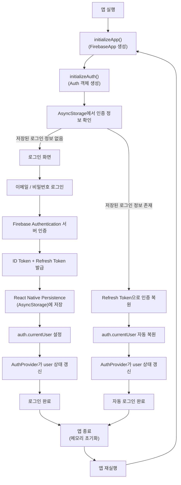

# 서로서가

서로서가는 책 대여, 탐색, 커뮤니티 기능을 중심으로 구성한 Expo React Native 앱입니다.
현재 프로젝트의 주 작업 대상은 루트의 Expo 앱이며, Android 네이티브 폴더는 Expo/Android 빌드용 설정과 산출물을 담습니다.

## 기술 스택

- React Native
- Expo
- Expo Router
- TypeScript
- Firebase Authentication
- npm

## 실행 방법

```bash
npm install --legacy-peer-deps
```

Expo Go로 실행:

```bash
npm start 또는 npx expo start
```

Android 개발 빌드 실행:

```bash
npm run android
```

Dev Client Metro 실행:

```bash
npm run start:dev-client
```

타입 검사:

```bash
npm run typecheck
```

## 프로젝트 구조

```text
app/
  _layout.tsx          앱 최상위 레이아웃. AuthProvider와 Stack 연결
  index.tsx            로그인 상태에 따라 login 또는 tabs/home으로 redirect
  login.tsx            이메일/비밀번호 로그인 화면
  (tabs)/
    _layout.tsx        하단 탭 레이아웃. 비로그인 사용자의 탭 직접 접근 차단
    home.tsx           홈 화면
    explore.tsx        탐색 화면
    rental.tsx         대여 화면
    community.tsx      커뮤니티 화면
    mypage.tsx         마이페이지 및 로그아웃

auth/
  AuthProvider.tsx     Firebase Auth 상태를 앱 전체에 공급하는 Context Provider

lib/
  firebase.ts          Firebase 앱/Auth 초기화

components/
  BookShelf.tsx        홈 화면 책장 UI
  ExploreBookCard.tsx  탐색 화면 책 카드 UI
  ChatRoomRow.tsx      커뮤니티 채팅방 행 UI
  PlaceholderScreen.tsx 공통 placeholder 화면

constants/
  theme.ts             색상, 간격, radius, typography 상수

data/
  books.ts             홈/대여 관련 목데이터
  exploreBooks.ts      탐색 화면 목데이터
  chatRooms.ts         커뮤니티 목데이터

hooks/
  useHomeBooks.ts      홈 화면 데이터 로딩 훅
  useExploreBooks.ts   탐색 화면 데이터 로딩 훅
  useChatRooms.ts      커뮤니티 데이터 로딩 훅

models/
  Book.ts              책 데이터 타입
  ChatRoom.ts          채팅방 데이터 타입

services/
  bookRepository.ts    책 데이터 접근 계층
  chatRepository.ts    채팅방 데이터 접근 계층

types/
  firebase-auth-rn.d.ts Firebase Auth React Native 타입 보정

assets/, pictures/     이미지 리소스
docs/                  기획/발표 자료
android/               Android 네이티브 빌드 설정
```

`seoroseoga_3_activities/`가 있는 경우, 이 폴더는 업그레이드 이전 Android/Kotlin 버전의 레퍼런스입니다. 현재 Expo 앱 구현 대상에는 포함하지 않습니다.

## 인증 흐름

현재 인증은 Firebase Authentication 기반 이메일/비밀번호 로그인으로 구성되어 있습니다.

- `app/_layout.tsx`에서 `AuthProvider`가 앱 전체를 감쌉니다.
- `AuthProvider`는 Firebase Auth의 `onAuthStateChanged`를 구독해서 `user`, `loading`, 로그인/로그아웃 함수를 제공합니다.
- 각 화면에서는 `AuthProvider` 속 정의된 `useAuth()`로 인증 상태와 함수를 가져옵니다.
- 즉 export 된 전역 함수 컴포넌트 AuthProvider 이 AuthContext 라는 맥락 주입 호스를 통해서 모든 그 자신이 감싸고 있는 특정 ui컴포넌트(ui 별 파일!)에 전역적으로 맥락을 공급합니다.
- `app/index.tsx`는 앱 진입 시 로그인 상태를 확인해서 `/login` 또는 `/(tabs)/home`으로 보냅니다.
- `app/(tabs)/_layout.tsx`는 로그인하지 않은 사용자가 탭 화면에 직접 접근하면 `/login`으로 보냅니다.
- `app/(tabs)/mypage.tsx`에서 로그아웃을 실행합니다.

## Firebase Auth 주의사항

React Native에서 Firebase Auth 로그인 유지에는 ram 이 아닌 디스크 속 저장소인 AsyncStorage 기반 persistence가 필요합니다.

이 프로젝트는 `lib/firebase.ts`에서 다음 흐름으로 Auth를 초기화합니다.

- Firebase App 초기화
- `initializeAuth`로 React Native persistence 연결
- 이미 초기화된 경우 `getAuth`로 기존 Auth 인스턴스 재사용

위 구조를 그림으로 그리면 다음과 같습니다.



Firebase Auth의 React Native persistence 관련 export는 번들/타입 해석 차이 때문에 TypeScript에서 바로 잡히지 않을 수 있습니다. 그래서 `types/firebase-auth-rn.d.ts`에서 `getReactNativePersistence` 타입을 보정합니다.

위 문제의 핵심은 다음과 같습니다.

- Metro 런타임 번들러는 React Native 조건의 Firebase Auth 번들을 선택할 수 있습니다.
- TypeScript는 일반 public 타입 파일을 먼저 선택해 `getReactNativePersistence`를 못 찾을 수 있습니다.
- 따라서 런타임은 동작하지만 타입체크만 실패하는 상황이 생길 수 있습니다.

이 타입 보정 파일은 그 차이를 메우기 위한 용도입니다.

## 현재 구현 범위

- Expo Router 기반 앱 라우팅
- 하단 탭 5개 구성: 탐색, 대여, 홈, 커뮤니티, 마이페이지
- 홈 화면 책장 UI
- 탐색 화면 책 카드 UI
- 커뮤니티 채팅방 목록 UI
- Firebase 이메일/비밀번호 로그인
- 앱 전체 AuthProvider 연결
- 비로그인 사용자의 탭 화면 직접 접근 차단
- 마이페이지 로그아웃
- 목데이터 기반 화면 구성

## 앞으로 작업할 수 있는 항목

- Google 학교 메일 로그인
- 학교 메일 도메인 제한
- Firestore 연동
- 목데이터를 실제 서버/Firebase 데이터로 교체
- 회원가입/프로필 화면
- 로그인 에러 메시지 세분화
- Firestore Security Rules 작성

## 주요 npm script

- `npm start`: Expo Go용 Metro 서버 실행
- `npm run start:dev-client`: Expo Dev Client용 Metro 서버 실행
- `npm run android`: Android 개발 빌드 생성 및 실행
- `npm run ios`: iOS 개발 빌드 생성 및 실행
- `npm run web`: Web 개발 서버 실행
- `npm run typecheck`: TypeScript 타입 검사
- `npm run lint`: Expo ESLint 검사
