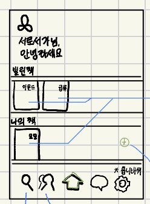
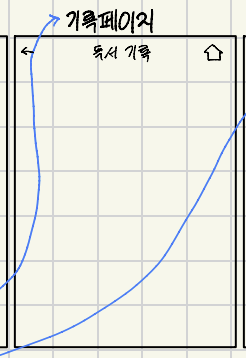
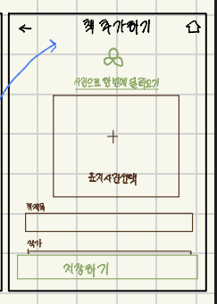

# 화면 기능 명세 → DB 테이블 명세

## 1. [스플래시 및 로그인 화면]


**이 화면의 목적:**

- 서비스 브랜딩 전달 및 사용자의 학교 계정을 통한 본인 인증 및 로그인

**들어오는 경로:**

- 앱 최초 실행 시 또는 로그아웃 상태에서 앱 진입 시

**보이는 정보:**

- 서비스명 (`서로서가`)
- `학교 계정으로 로그인` 버튼

**사용자가 하는 행동:**

- `학교 계정으로 로그인` 버튼 클릭

**행동 후 결과:**

- 인증 절차 진행 후 성공 시 '메인 화면(홈)'으로 이동

**저장되어야 하는 데이터:**

- 사용자 로그인 토큰, 유저 식별자, 소속 학교 정보

## 2. [메인 화면 (홈)]



**이 화면의 목적:**

- 대여 중인 책, 소장 중인 책 목륵 조회 및 주요 기능(등록, 검색, 프로필, 설정 등)으로 이동하는 대시보드 역할

**들어오는 경로:**

- 로그인 성공 시
- 다른 화면의 하단 네비게이션 바에서 `홈(집 아이콘)` 버튼 클릭 시
- 상세 화면 상단의 `홈(집 아이콘)` 버튼 클릭 시

**보이는 정보:**

- 사용자 환영 문구 (`서로서가님, 안녕하세요`)
- `빌린 책` 목록 (예: 아몬드, 급류 등)
- `나의 책` 목록 (예: 모모 등) + 나의 책 추가 버튼 (`+` 아이콘)
- 하단 네비게이션 바 (검색 `🔍`, 빌릴래요/빌려줄래요 화면으로 이동하는 버튼 `👥`, 홈 `🏠`, 대화/메시지 `💬`, 설정 `⚙️`)

**사용자가 하는 행동:**

- 책 목록 중 특정 도서 카드를 클릭
- `+` (추가) 버튼 클릭
- 하단 네비게이션 바의 메뉴 아이콘 클릭

**행동 후 결과:**

- 도서 카드 클릭 시 ➡️ '도서 상세 화면'으로 이동
- `+` 버튼 클릭 시 ➡️ 책 등록(추가) 화면으로 이동
- 하단 메뉴 클릭 시 ➡️ 해당 기능 화면으로 이동

**저장되어야 하는 데이터:**

- (조회 전용 → 여기서 새로운 데이터를 저장하지는 X : 내가 대여한 책 또는 내가 등록한 책에 대한 데이터를 불러와서 그냥 띄우는 것) 대여 도서 목록, 소유 도서 목록 데이터

## 3. [도서 상세 화면]


**이 화면의 목적:**

- 선택한 책의 상세 정보 확인 및 해당 도서에 대한 독서 기록 작성 시작

**들어오는 경로:**

- 메인 화면의 '빌린 책' 또는 '나의 책' 목록에서 특정 도서 클릭 시

**보이는 정보:**

- 상단 네비게이션 (뒤로가기 `←`, 홈 `🏠`)
- 책 커버 이미지 + 나열된 그 책의 상세 정보 (`급류`, `정대건` 등)
- `기록하기` 버튼

**사용자가 하는 행동:**

- `기록하기` 버튼 클릭
- `←` (뒤로가기) 또는 `🏠` (홈) 버튼 클릭

**행동 후 결과:**

- `기록하기` 버튼 클릭 시 ➡️ **'기록 페이지 (독서 기록)'** 화면으로 이동
- 뒤로가기 클릭 시 ➡️ 이전 화면으로 이동

**저장되어야 하는 데이터:**

- (조회 전용) 해당 도서의 상세 Metadata (제목, 저자, 커버 이미지, 대여 상태 등)

## 4. [기록 페이지 (독서 기록)]



**이 화면의 목적:**

- 사용자가 책을 읽고 감상, 메모, 인상 깊은 구절 등을 작성하고 저장

**들어오는 경로:**

- 메인 화면의 `+` (추가) 버튼 클릭 시 나오는 도서 상세 화면의 `기록하기` 버튼 클릭 시

**보이는 정보:**

- 상단 네비게이션 (뒤로가기 `←`, 홈 `🏠`)
- 화면 타이틀 (`독서 기록`)
- 메모 및 기록을 작성할 수 있는 텍스트/입력 영역

**사용자가 하는 행동:**

- 독서 내용/감상문 작성
- 저장 버튼 클릭 (또는 완료 행동)
- 뒤로가기 `←` 또는 홈 `🏠` 아이콘 클릭

**행동 후 결과:**

- 작성한 기록이 저장되고 메인 화면 또는 이전 화면으로 이동

**저장되어야 하는 데이터:**

- 책 ID, 작성 일자, 기록 본문 텍스트, 공개 여부 등

## 5. [책 추가하기 화면] 명세



**이 화면의 목적:**

- 사용자가 본인이 소장하고 있거나 읽을/읽은 책을 자신의 서재(`나의 책`)에 새롭게 등록

**들어오는 경로:**

- 메인 화면의 '나의 책' 섹션 우측 `+` (추가) 버튼 클릭 시

**보이는 정보:**

- 상단 네비게이션 (뒤로가기 `←`, 홈 `🏠`)
- 화면 타이틀 (`책 추가하기`)
- `사진으로 한 번에 불러오기` 버튼 (OCR 또는 표지 인식 기능)
- 표지 사진 선택/업로드 영역 (`+ 표지 사진 선택`)
- 책 제목 입력 필드 (`책제목`)
- 작가/저자 입력 필드 (`작가`)
- 하단 `저장하기` 버튼

**사용자가 하는 행동:**

- 직접 책 제목, 작가 입력 또는 표지 사진 등록 (`사진으로 한 번에 불러오기` 사용 가능)
- `저장하기` 버튼 클릭
- 뒤로가기 `←` 또는 홈 `🏠` 아이콘 클릭

**행동 후 결과:**

- `저장하기` 클릭 시 ➡️ DB에 책 데이터가 생성되고 '메인 화면(홈)'으로 이동 (메인 화면의 '나의 책' 목록에 바로 업데이트되어 표시 → 나의 책 , 빌린 책 목록에 뜨는 책들을 빌린 시간 , 등록한 시간 기준 최신 순으로 나열하게끔 프론트 코드 작성 즉 , 방금 내 책으로 등록 했거나 방금 내가 빌린 책이 가장 책장에서 먼저 뜨도록)

**저장되어야 하는 데이터:**

- 책 제목, 저자명, 표지 이미지 URL, 소유자 UID(`ownerId`), 대여 가능 여부 플래그, 등록일자

---

DB 스키마

앱 전체의 DB 스키마는

- `users` (사용자 정보)
- `books` (앱 전체에 등록된 '실제 책 한 권 한 권'의 정보)
- `records` (독서 기록 / 메모)

이렇게 3개로 갈겁니다.

### ① `books` 컬렉션 (책 정보)

> **핵심 아이디어:** "내가 등록한 책", "남한테 빌려준 책", "내가 빌린 책"을 **별도의 테이블로 나누지 않고, `books` 하나에서 상태값과 소유자/대여자 ID로 관리**합니다.
> 

책을 등록할 때(직접 입력하든, 네이버/카카오 도서 API나 OCR로 불러오든) 들어오는 정보들을 아래처럼 포함시키면 됩니다.

JSON

```json
// collections / books / {book_id}
{
  "bookId": "book_abc123",              // Firestore 자동 생성 문서 ID

  // 책 기본 정보 (사용자가 추가하거나 도서 검색으로 들어온 정보)
  "title": "모모",                       // 책 제목
  "author": "미하엘 엔데",                // 작가 / 저자
  "publisher": "비룡소",                  // 출판사
  "isbn": "9788949110036",               // ISBN
  "coverUrl": "https://storage...",      // 표지 이미지 경로
  "description": "시간 도둑과 빼앗긴 시간을...", // 책 한줄 설명 또는 메모

  // 소유 및 대여 관리 필드
  "ownerId": "user_my_uid_123",          // 책을 등록한 사용자 UID
  "isLendable": false,                   // true: 대여 가능으로 등록 / false: 혼자 보는 개인 소장용
  "borrowerId": null,                    // 빌려간 사람 UID (빌려준 적 없으면 null)
  "status": "PRIVATE",                   // "PRIVATE"(개인소장), "AVAILABLE"(대여가능), "BORROWED"(대여중)

  "createdAt": "2026-02-18T12:00:00Z"    // 등록일자
}
```

책의 정보들은 : google books api 에서 받아오거나 직접 입력

### 핵심 동작 방식

1. **그냥 내 책으로 등록할 때 (`나의 책` + 버튼)**
    - 입력 폼에서 제목, 작가, 출판사, 표지 사진을 채워서 넘깁니다.
    - `isLendable: false`, `status: "PRIVATE"` 로 저장됩니다.
    - 결과: 내 서재(`나의 책`) 목록에만 뜨고, 남들이 보는 대여 마켓에는 노출되지 않습니다.
2. **빌려줄 책으로 등록할 때 (또는 내 책 중 빌려주기로 상태 변경할 때)**
    - 동일하게 기본 정보를 입력하되,
        - “빌려줄래요” 버튼에서 트리거 된 책 등록 페이지인지를 확인하는 로직을 삽입하거나 또는
        - 별도의 대여용 책 등록 페이지를 만들거나 아니면
        - 그냥 책 등록 페이지에 대여 설정 토글/스위치를 만들어 놔서 사용자가 킬 수 있게..? 모르겠음
        
        이렇게 하고 저장을 하면
        
    - `isLendable: true`, `status: "AVAILABLE"` 로 저장됩니다.
    - 결과: 내 서재에도 뜨고, **"빌릴래요/빌려줄래요" (👥 버튼) 화면에도 노출되어 다른 학생들이 신청**할 수 있게 됩니다.

즉, **책 데이터의 기본 메타데이터(제목, 작가, 출판사 등)는 동일한 구조**로 저장되고, 대여 여부 플래그(`isLendable`) 하나로 내 개인용인지 공유용인지가 구분되는 구조

#### 각 경우별 조회를 위한 쿼리식의 형태를 보면,

#### 1. 메인 화면의 `나의 책` (내가 소장/등록한 모든 책)

> 대여 가능 여부(`isLendable`)와 관계없이 **내가 내 서재에 추가한 모든 책**을 보여줍니다.
> 

JavaScript

```json
// ownerId가 내 UID인 모든 책
const q = query(
  collection(db, "books"),
  where("ownerId", "==", myUid)
);
```

#### 2. 메인 화면의 `빌린 책` (내가 남에게 빌려서 읽는 중인 책)

> 책 원래 주인이 누구든 상관없이, **현재 대여자(`borrowerId`)가 나로 지정된 책**만 보여줍니다.
> 

JavaScript

```json
// borrowerId가 내 UID인 책
const q = query(
  collection(db, "books"),
  where("borrowerId", "==", myUid)
);
```

#### 3. 내가 남한테 빌려준 책 목록 (내 마이페이지나 대여 관리 화면용)

> 내가 주인이면서(`ownerId == myUid`), **현재 누군가가 빌려간 상태(`status == "BORROWED"`)인 책**만 정확히 골라냅니다.
> 

JavaScript

```json
// 내가 주인 + 현재 대여중 복합 쿼리
const q = query(
  collection(db, "books"),
  where("ownerId", "==", myUid),
  where("status", "==", "BORROWED")
);
```

#### 4.  `"빌릴래요" 누르고 들어 갔을` 화면 (남들이 등록한 대여 가능 책 목록을 띄울때 쓰면 됨)

> 내가 아닌 남이 등록했으면서(`ownerId != myUid`), **대여 가능으로 설정해둔(`isLendable == true`) 책**만 보여줍니다.
> 

#### Firestore 쿼리 + 클라이언트 필터링으로 구현 할 것

DB에서는 `isLendable == true` 이면서 `status == "AVAILABLE"` (대여 가능 상태)인 책을 전부 가져온 뒤, **React Native 코드 단에서 내 책만 제외**하는 방식입니다.

JavaScript

```jsx
// 1. Firestore에서 "대여 가능한 모든 책"을 가져옴
const q = query(
  collection(db, "books"),
  where("isLendable", "==", true),
  where("status", "==", "AVAILABLE")
);

const querySnapshot = await getDocs(q);

// 2. 클라이언트 코드에서 "내 책(ownerId == myUid)"만 필터링해서 제거
const availableBooksForMe = querySnapshot.docs
  .map(doc => ({ id: doc.id, ...doc.data() }))
  .filter(book => book.ownerId !== myUid); // 👈 여기서 내 책 제외!
```

- 그냥 조건 3개를 걸어서 Firestore 로 요청하면 복합 인덱스 설정 때문에 오류 뜰 수 있음 따라서 2개 조건만 걸어서 요청 하고 , 클라이언트에서 한번 더 걷어낼 것.

### ② `records` 컬렉션 (독서 기록 / 감상문)

> **핵심 아이디어:** 화면 4(기록 페이지)에서 작성하는 메모입니다. 어떤 책에 대한 기록인지 `bookId`를 연결하고, 작성자가 누구인지 `userId`를 적어둡니다.
> 
- **문서 ID (Document ID):** 자동 생성 고유값 (예: `record_xyz789`)

```json
// collections / records / {record_id}
{
  "recordId": "record_xyz789",
  "bookId": "book_abc123",       // 어떤 책에 대한 기록인지 (books 컬렉션의 ID)
  "userId": "user_my_uid_123",    // 작성자 UID
  "content": "오늘 30페이지까지 읽었는데 너무 재밌다...", // 메모 내용
  "isPublic": false,              // 공개 여부 (나만보기/친구공개 등)
  "createdAt": "2026-02-18T11:00:00Z"
}
```

**도서 상세 화면에서 '이 책의 독서 기록' 가져오기(한 사용자가 한 책에 대해 남긴 기록):**

```tsx
where("bookId", "==", 현재책ID) AND where("userId", "==", 내UID)
```

### ③ `users` 컬렉션 (사용자 정보)

> 로그인할 때 Firebase가 주는 정보와 사용자 기본 프로필을 저장
> 
- **문서 ID (Document ID):** `auth.currentUser.uid` (FIREBASE AUTH SDK 사용시 OAUTH2 방식으로 구글과의 와리가리로 사용자를 인증한 FIREBASE가 각 사용자에게 발급 해주는 UID , REFRESH TOKEN(이거 로컬 ASYNC STORAGE에 저장 될 거임), SESSION 토큰 그리고 인증과정에서 구글에서 발급 해주는 사용자의 정보를 FIREBASE 가 발급 받아서 넘겨준 사용자의 개인정보를 DB 에 저장할거임 , 이 사용자 정보 테이블은 사용자 UID를 그대로 문서 ID 즉 기본키로 사용!)

JSON

```json
// collections / users / {user_uid}
{
  "uid": "user_my_uid_123",
  "email": "student@pnu.ac.kr",
  "displayName": "서로서가",
  "schoolName": "부산대학교",
  "createdAt": "2026-02-18T09:00:00Z"
}
```